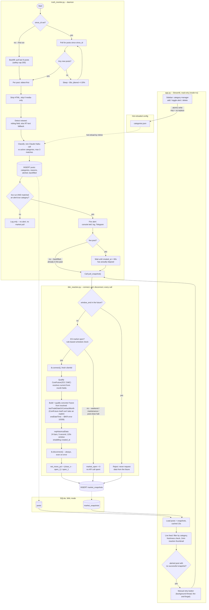

# Truth Monitor — App Spec

Design document for a Streamlit app monitoring @realDonaldTrump on Truth Social:
classify posts by category, alert on the ones that matter, link out to X for
cross-platform reaction, and pull ES futures price action around the post to see
if the
market actually moved. This is the spec to build from — no app code here, this is
what Claude Code should read first.

## Architecture

Three components, communicating only through files — never in-process:

```
categories.json  <--edits from-->  app.py (sidebar)
       |
       v (hot-reload, mtime-checked)
truth_monitor.py  --writes-->  SQLite (WAL)  <--reads (mode=ro)--  app.py
       |                                                              |
       v (on alert)                                                   v (on-demand button)
ibkr_reaction.py  --writes market snapshot-->  SQLite  <--reads--  app.py
```

- **`truth_monitor.py`** — daemon. First run: database empty → backfill last 20
  posts, classify, record, no alerts (it's history). Every run after: poll for new
  posts only, classify, record, alert on category matches flagged `alert: true`.
- **`app.py`** — Streamlit dashboard + category manager (sidebar) + live feed
  (main panel), read-only against the database.
- **`ibkr_reaction.py`** — historical price snapshots around a post's timestamp,
  via `ib_insync` against a real IB Gateway connection. Exactly one
  connect-pull-disconnect per post, ever — a fixed 2-minute window anchored to
  that post's own timestamp, never a held-open connection or a recurring
  schedule — see the rules below.

The dashboard never writes to the posts table. The daemon never writes to
`categories.json`. Each piece can restart independently without the others
noticing.

**Atomic writes for hot-reloaded config.** `categories.json` and
`ibkr_settings.json` are both read by mtime-check while potentially being
edited by the Streamlit sidebar at the same time — a daemon read landing
mid-write would see a truncated or invalid file. Write via
`tmp = path + ".tmp"; json.dump(..., open(tmp, "w")); os.replace(tmp, path)`
rather than writing the target file directly — `os.replace` is atomic on both
Windows and POSIX, so the daemon only ever sees a complete old or complete new
file, never a partial one.

## System flowchart

End-to-end pipeline, as actually implemented — backfill vs. live, the
classification/alert gate, and the IBKR pull (including the front-month
`Future` resolution `ContFuture` historical pulls require; see "Market
reaction (IBKR)" below for why).



## Classification

*(unchanged from prior draft — included here for completeness)*

### Design decisions

| Decision | Choice | Why it matters |
|---|---|---|
| Matching strictness | **Inclusive** — flag plausible/tangential connections | Haiku defaults conservative without explicit permission to loosen |
| Retweets | **Classify, flag as retweet** | `(retweet)` prefix on the reason distinguishes "he said this" from "he boosted this" without a schema change |
| Category cap | **Max 3, ranked** | Forces prioritization; uncapped + inclusive tends to over-tag |

### Retweet detection

```python
def is_retweet(post: dict) -> bool:
    """API's 'reblog' field is the primary signal; text fallback because it's
    inconsistent across pulls -- both 'RT @user...' and 'RT: <url>' show up."""
    if post.get("reblog"):
        return True
    text = strip_html(post.get("content", "")).strip()
    return text.startswith(("RT ", "RT:", "RT@"))
```

### Prompt template

```python
def build_prompt(text: str, categories: list[dict], is_retweet: bool) -> str:
    cat_list = "\n".join(f"- {c['name']}: {c['description']}" for c in categories)
    context_line = (
        "This post is a retweet/repost of someone else's content.\n"
        if is_retweet else ""
    )
    return (
        "Classify the following social media post against this list of categories.\n\n"
        f"CATEGORIES:\n{cat_list}\n\n"
        f"POST:\n{context_line}{text}\n\n"
        "Instructions:\n"
        "- Include plausible or indirect connections, not only posts that are "
        "directly and explicitly about a category. Err toward flagging a "
        "reasonable connection rather than requiring certainty.\n"
        "- Select at most 3 categories. If more than 3 plausibly apply, keep only "
        "the 3 most relevant, ordered from most to least relevant.\n"
        "- If this post is a retweet, prefix each reason with '(retweet) '.\n"
        "- Each reason is one short sentence.\n"
        "- If nothing plausibly connects, return an empty list.\n\n"
        "Respond with ONLY a JSON object, no other text:\n"
        '{"matches": [{"category": "<exact name from the list above>", '
        '"reason": "<one short sentence>"}]}'
    )
```

### Output schema

```json
{
  "matches": [
    {"category": "Economy", "reason": "Implies tariff policy affecting trade balance."}
  ]
}
```

`category` must exactly match a `name` in the active category list — validate and
drop anything that doesn't, since a hallucinated name would silently fail to join
against `alert` flags. Empty `matches` is valid and expected.

### Model and parameters

`claude-haiku-4-5-20251001`, `max_tokens: 300`, no temperature override. This
is a starting point, not a fixed choice — swap it freely if classification
quality doesn't hold up in practice.

---

## Cross-platform link (X / Twitter)

Not a data pull — just a convenience link on each dashboard row so you can check
whether/how a post is spreading on X, since Trump doesn't auto-crosspost.

Two links per post, both constructed client-side with no API call:

1. **Permalink to the original Truth Social post** — currently missing from the
   dashboard entirely, worth adding regardless of X:
   ```
   https://truthsocial.com/@realDonaldTrump/posts/{post_id}
   ```
2. **X search link** — searches X for the post's text, so you can see if/how it's
   being discussed or quoted there:
   ```
   https://twitter.com/search?q={urlencode(first_12_words_of(text))}&src=typed_query&f=live
   ```
   `f=live` sorts by recency rather than relevance, which is what you want for a
   "how is this landing right now" check. Truncate to ~12 words — X's search
   silently degrades on very long exact-match queries.

Both render as a `st.link_button` or plain markdown link in the dataframe row (or
a details expander, since `st.dataframe` doesn't support clickable links inline
without a column config workaround). No new table, no new classification step —
purely presentation.

---

## Market reaction (IBKR)

Every pull is connect → request → disconnect, immediately. No held-open
connection, ever — not in the daemon, and especially not in Streamlit, where
`ib_insync`'s asyncio-based socket doesn't survive a rerun cleanly and is the
likely cause of the crashes you saw. The only long-running connections in this
whole system are the Truth Social poll loop (and, if it's ever built, an
equivalent X/Twitter monitor) — IBKR is request/response only, always.

### Instrument: ES futures, not SPY

Switched from SPY to the **E-mini S&P 500 future (ES)** on CME Globex. SPY only
trades meaningfully during roughly 4am–8pm ET; ES trades continuously from
Sunday 6:00pm ET through Friday 5:00pm ET, with just a 1-hour daily maintenance
break (5:00–6:00pm ET) and a 15-minute halt specific to equity-index futures
right after the cash close (4:15–4:30pm ET). That near-total coverage is
exactly what's needed for an account that posts at all hours and that you've
directly observed moving markets during European and Japanese session hours —
windows SPY simply isn't trading in at all.

Use `ib_insync`'s continuous-contract helper rather than a specific expiry, so
historical pulls don't need manual handling of the quarterly (Mar/Jun/Sep/Dec)
contract rollover:

```python
from ib_insync import ContFuture
contract = ContFuture('ES', 'CME')
```

### The design, simply

**Exactly one market-data pull per post, ever.** Not a growing window, not a
recurring re-pull for as long as the app runs — a single, fixed, small window:
**5-second ES bars for the 2 minutes straddling the post** (roughly 1 minute
before through 1 minute after `created_at`). No live price data is ever kept
open; nothing about this depends on the app staying running.

This applies identically whether the post was just detected live, or
discovered during a backfill of posts from 2–3 days ago after the app was
closed for a while — the window is anchored to the post's own `created_at`,
not to "now," so an old post's window is just as pullable as a fresh one.
IBKR's historical data endpoint accepts any past `endDateTime`; a post from
three days ago and a post from three minutes ago are the same kind of request,
just pointed at a different moment.

Sequence:

1. **Live post, just flagged alert-worthy:** wait until the window's end
   (`created_at + 60s`) has actually elapsed — can't pull data from the
   future — then pull once.
2. **Backfilled post, already old:** the window is already fully in the past,
   so pull immediately during backfill processing, no waiting needed.
3. **Before attempting either:** check whether ES was actually trading during
   that window. If not (weekend, daily maintenance break, post-cash-close
   halt), skip the API call entirely and record `market_open = 0` directly —
   no point spending a request on a window you already know is closed.
4. If the pull succeeds: store the 24-bar series (2 minutes at 5-second
   resolution), and compute net move from its first Open to its last Close.
5. **Manual retry button** exists only to recover from a failed automatic
   attempt (Gateway wasn't reachable, connection error) — it's the same fixed
   window, so retrying later gives the identical result. Not a way to check
   back for an updated reading; there's nothing further out to check.

### Design decisions

| Decision | Choice | Why |
|---|---|---|
| Instrument | **ES continuous futures**, not SPY | Near-24/5 coverage matches when Trump actually posts and when you've observed real international reaction |
| Bar size | **5 seconds** | Fine enough to see the shape of a fast move, without the ~33-minute single-call ceiling of 1-second bars |
| Window | **Fixed 2 minutes straddling the post, always** — never grows, never re-pulls | Matches what's actually wanted: a snapshot of the reaction, not a live-updating feed. Removes any need for a recurring scheduler or a "how long to keep watching" setting |
| Anchor | **`created_at`**, not "now" | The window is defined relative to the post, so it's identically pullable whether the post is 10 seconds old or 3 days old — backfill and live detection use the exact same function |
| Trigger | **Once per post, live or during backfill** — plus a manual retry only on failure | No continuous connection, no ongoing schedule; nothing about market data collection depends on the app staying open |
| Gate | **Check ES's trading schedule before pulling** | Avoids spending an API call on a window that's already known to be closed |

### Snapshot pull

Config, via `.env` (same pattern as everything else in this project):

```
IBKR_HOST=127.0.0.1
IBKR_PORT=4002              # see port table below -- confirm against your
                              # actual Gateway/TWS config, this varies
IBKR_CLIENT_ID_DAEMON=101
IBKR_CLIENT_ID_DASHBOARD=102
```

IB Gateway/TWS default ports — pick the one matching your actual setup, don't
assume:

| App | Paper | Live |
|---|---|---|
| IB Gateway | 4002 | 4001 |
| TWS | 7497 | 7496 |

ES trading-schedule check, run before any pull is attempted:

```python
from datetime import datetime, timedelta, timezone

def es_market_open(window_start_utc: datetime, window_end_utc: datetime) -> bool:
    """Rule-based check against ES's known schedule. Does NOT cover CME
    holidays -- an unrecognized holiday falls through to the existing
    empty-bars handling in pull_snapshot rather than being caught here.
    Good enough to skip the obvious closed windows (weekends, daily
    maintenance, post-cash-close halt) without wasting an API call."""
    import zoneinfo
    et = zoneinfo.ZoneInfo("America/New_York")
    for t in (window_start_utc, window_end_utc):
        t_et = t.astimezone(et)
        dow, hm = t_et.weekday(), t_et.hour * 60 + t_et.minute
        if dow == 4 and hm >= 17 * 60:            # Fri after 5pm ET
            return False
        if dow == 5:                              # all day Saturday
            return False
        if dow == 6 and hm < 18 * 60:              # Sun before 6pm ET
            return False
        if 17 * 60 <= hm < 18 * 60:                # daily maintenance 5-6pm
            return False
        if 16 * 60 + 15 <= hm < 16 * 60 + 30:      # post-cash-close halt
            return False
    return True

def pull_snapshot(post_id: str, created_at: datetime, client_id: int) -> dict:
    """Connect, pull the fixed 2-minute 5-second-bar window straddling
    created_at, disconnect. Same call whether the post is seconds or days
    old -- the window is anchored to created_at, never to "now".
    client_id: IBKR_CLIENT_ID_DAEMON or IBKR_CLIENT_ID_DASHBOARD -- never
    share one across both."""
    window_start = created_at - timedelta(seconds=60)
    window_end = created_at + timedelta(seconds=60)

    if not es_market_open(window_start, window_end):
        return {"post_id": post_id, "bars": None, "error": None,
                "market_open": 0}

    ib = IB()
    try:
        ib.connect(IBKR_HOST, IBKR_PORT, clientId=client_id, timeout=10)
        contract = ContFuture('ES', 'CME')
        ib.qualifyContracts(contract)
        bars = ib.reqHistoricalData(
            contract,
            endDateTime=window_end,   # always an explicit past timestamp --
                                        # never '', since the window is always
                                        # anchored to the post, not to "now"
            durationStr='120 S',      # fixed, always -- never grows
            barSizeSetting='5 secs',
            whatToShow='TRADES',
            useRTH=False,             # Trump posts at all hours
            formatDate=2,
        )
        df = util.df(bars)
        return {"post_id": post_id, "bars": df, "error": None,
                "market_open": 1 if len(df) else 0}
    except Exception as e:
        return {"post_id": post_id, "bars": None, "error": str(e),
                "market_open": None}   # None = unknown, distinct from a
                                          # confirmed-closed 0
    finally:
        ib.disconnect()   # always, even on failure
```

### Pull timing

No recurring scheduler, no `ibkr_settings.json` interval setting — the timing
rule is just:

- **Live post:** the daemon waits until `created_at + 60s` has passed
  (typically under a minute, since the poll cycle itself takes ~30s), then
  calls `pull_snapshot` exactly once.
- **Backfill:** every backfilled post's window is already in the past, so
  `pull_snapshot` runs immediately as each post is processed, no waiting.
- **Retry:** only on a failed attempt (`error` set, `market_open is None`) —
  the manual button re-runs the identical call.

### Client ID

Connections are brief, not held open — but a backfill batch (potentially
pulling for many old posts in a row) and a live daemon pull, or a manual
retry click, could still land in the same instant. Cheap insurance: fixed,
distinct IDs — `IBKR_CLIENT_ID_DAEMON` and `IBKR_CLIENT_ID_DASHBOARD` from
`.env` — rather than sharing one.

### Reaction shape

Let $O_1$ be the Open of the window's first bar, and $C_n$ the Close of its
last bar — both from the one pull this post ever gets:

$$
N = \frac{C_n - O_1}{O_1} \times 100
\qquad\text{(net move over the 2-minute window, \%)}
$$

One number, computed once, stored once. **The shape of the move within that
2 minutes is read off the thumbnail chart, not computed as a separate
statistic** — see below.

### Thumbnail chart in the dashboard grid

Each post row renders its single 24-bar series directly — no stitching, no
"most recent pull," since there's only ever one pull to show.
- Keep it a genuine thumbnail (no axes, no labels) — a shape-at-a-glance in a
  grid row, not a chart to analyze in place.
- Rows with `market_open = 0` show no chart (or a small "market closed"
  marker) rather than an empty/misleading blank space.

### Storage

```sql
CREATE TABLE IF NOT EXISTS market_snapshots (
    post_id        TEXT PRIMARY KEY REFERENCES posts(id),
    pulled_at      TEXT,        -- wall-clock time this pull was attempted
    bars_json      TEXT,        -- the 24-bar (2min @ 5s) series, or null
    open_price     REAL,        -- O_1
    close_price    REAL,        -- C_n
    net_move_pct   REAL,        -- N, computed once at pull time
    market_open    INTEGER,     -- 0 = confirmed closed, 1 = open, null = unknown/error
    error          TEXT
)
```

`post_id` as primary key, not an autoincrement id — this table really is
one row per post now, since there's exactly one pull (occasionally retried
in place, not appended as a new row) rather than an accumulating series.

### Edge cases

- **Market closed.** Checked *before* pulling via `es_market_open()` for the
  common cases (weekends, the daily 1-hour maintenance break 5–6pm ET, the
  15-minute post-cash-close halt 4:15–4:30pm ET). CME holidays aren't covered
  by that rule-based check — an unrecognized holiday will still attempt the
  pull and come back with an empty/insufficient series, which the `len(df)`
  check in `pull_snapshot` catches anyway. Not a hard gap, just not
  pre-empted the same way the routine closures are.
- **Live post pulled too early.** If the daemon somehow calls `pull_snapshot`
  before `created_at + 60s` has actually elapsed, `endDateTime` would be in
  the future — reject this in code (assert the wait condition, don't rely on
  IBKR to reject it gracefully) rather than finding out what a future
  `endDateTime` actually does.
- **Pacing violations.** A backfill of 50 posts is 50 quick pulls in
  succession — worth a small delay between them during backfill specifically,
  even though this is well under any documented rate limit, just to avoid
  hammering the Gateway in a tight loop.
- **Gateway connection state.** If IB Gateway isn't running or reachable,
  `pull_snapshot` returns `error` set and `market_open = None` (unknown,
  distinct from confirmed-closed); the daemon and dashboard keep working
  otherwise, and the manual retry button can pick it up later once the
  Gateway's back.
- **Contract rollover.** `ContFuture('ES', 'CME')` handles this automatically
  for historical pulls — worth a spot-check around a quarterly roll date
  (Mar/Jun/Sep/Dec) once real data is flowing, to confirm the stitched series
  doesn't show an artificial jump at the roll.

### On-demand button: async, not blocking

Decision: fire async, populate the row on next refresh, rather than blocking
the UI while IBKR responds. `ib_insync` is asyncio-based under the hood, so
this is less friction than it would be with a purely synchronous client. This
now only applies to the manual retry-on-failure case, since there's no other
reason to click it.

---

## Phase 2 — Reaction profile (deferred, spec only)

Not part of the initial build. This is the natural next step once `posts` and
`market_snapshots` have accumulated real history: instead of only recording
whether a given post moved ES, use that history to estimate how a *new* post is
likely to move it, based on which past posts it resembles.

### The idea, formally

Embed each post's text into a vector $e_i \in \mathbb{R}^d$. For every historical
post with a completed snapshot, you have a labeled example $(e_i, N_i)$ — the
single net-move percentage over that post's fixed 2-minute window. There's no
horizon to choose anymore, since every post gets exactly one window: the label
is just whatever `net_move_pct` landed in `market_snapshots` for that post. If
a spike-magnitude or intra-window-shape feature turns out to be worth adding
later, it can be engineered from `bars_json` at that point — same treatment as
the reversion shape, which stays a chart rather than a stored number.

For a new post with embedding $e_x$, compute cosine similarity against every
labeled historical embedding:

$$s_i = \frac{e_x \cdot e_i}{\|e_x\|\,\|e_i\|}$$

Then estimate the new post's likely net move as a similarity-weighted average
over its $k$ nearest historical neighbors — a k-NN / Nadaraya–Watson kernel
regression:

$$\hat{N}(x) = \frac{\displaystyle\sum_{i \,\in\, \text{TopK}(s)} s_i \, N_i}
{\displaystyle\sum_{i \,\in\, \text{TopK}(s)} s_i}$$

Report the estimate alongside the spread of its $k$ neighbors' values, not
just the mean — the spread is what tells you whether "posts like this tend to
hold their move" is a real pattern or noise
with a misleadingly precise-looking average.

### Where retrieval fits, and where it doesn't

This is legitimate retrieval-augmented generation in the sense we discussed
earlier — retrieved precedent grounding an estimate — but it should stay a
**display-only overlay** at first, not feed back into the `alert: true` trigger
logic. Two reasons: the sample will be small for a long time (see below), and
letting a noisy estimate silently suppress or promote alerts is a worse failure
mode than an analyst just seeing an extra column and using their judgment.

### Infrastructure: no vector database needed

Given your HNSW background this is worth saying plainly so you don't over-build
it: **don't stand up a dedicated vector store for this.** At $d \approx 384$
(a small local embedding model) and even $N = 100{,}000$ historical posts — which
this account will not produce for years — brute-force cosine similarity is
$O(Nd)$ per query, about 38M multiply-adds, sub-millisecond on CPU. HNSW's
approximate-NN speedup exists to avoid brute-force search at millions-to-billions
of vectors; you're nowhere close, and won't be. Store the embedding as a BLOB
column (or a JSON float array, simpler to debug) directly in `posts`, compute
cosine similarity in Python/NumPy at query time. Revisit only if this account
somehow produces hundreds of thousands of posts.

**Format:** store **unit-normalized `float32` arrays**, not raw `float64`.
Normalizing at write time turns cosine similarity into a plain dot product at
query time — cheaper, and one less thing to get wrong when computing $s_i$
later. `float32` halves storage for no meaningful precision loss at this scale.
If the embedding model is ever swapped (see below), old and new vectors aren't
comparable — re-embed the historical corpus rather than mixing dimensions or
normalization conventions from two different models in one column.

### Embedding model choice

Anthropic doesn't serve embeddings directly. Two reasonable options:

- **Local, via your existing `cuda311` environment** — `sentence-transformers`
  with a small model (e.g. `all-MiniLM-L6-v2`, 384-dim, or `bge-small-en-v1.5` for
  somewhat better retrieval quality). Free, no external API dependency, and you
  already have the GPU environment sitting there for exactly this. My default
  recommendation, since it costs nothing incremental to your existing setup.
- **Voyage AI** — Anthropic's recommended embeddings partner, higher quality,
  costs money per call, adds an external dependency for a personal tool that
  doesn't need it.

Local wins here unless you have a specific reason to want Voyage's quality.

### Signal vs. noise — corrected

Earlier draft of this doc claimed individual posts are unlikely to move a
broad index measurably. That was too broad: for the specific categories this system flags as
alert-worthy (tariffs, Fed personnel, trade policy), fast sub-second reactions are
documented behavior, driven by headline-scanning algorithmic trading reading the
post text directly — this project is retail-scale infrastructure doing the same
thing institutional desks already do. The base rate claim still holds *across the
whole account* — a birthday post or a Christmas post is not going to move ES —
but it does not hold for the alert-worthy subset, which is precisely the point of
having alert-worthy categories at all.

What's still genuinely true, and worth keeping in mind: even among market-moving
posts, the *shape* of the reaction varies — some spikes fully revert within
the 2-minute window, others hold through it. That variation is exactly what
the thumbnail chart is for, and what a single $N$ can't distinguish on its
own — two posts with the same net move could look completely different inside
that window. Don't trust a k-NN estimate on $N$ until you have enough labeled
examples in a given category to see whether reversion or continuation
dominates for posts like it — with only a handful of
examples, you won't yet be able to tell "this category tends to revert" from
"these two particular posts happened to revert."

### Cold start

Only rows in `market_snapshots` with `market_open = 1` and no `error` count as
labeled examples — a post that landed outside ES trading hours, or whose pull
failed, simply isn't part of the training set. Given most Trump posts land
during hours ES is open (it trades near-continuously), the real bottleneck is
volume of alert-worthy posts, not market-hours coverage — but the labeled set
still accumulates slowly since only alert-worthy posts get pulled at all; plan on
this being a months-long accumulation before $k$-NN estimates are worth looking
at, not a next-week feature.

### Decisions

- **Minimum labeled corpus before showing an estimate: 50 posts.** Below that,
  the dashboard shows "insufficient history" rather than a k-NN estimate.
- **Embed text plus assigned categories, not raw text alone.** Expected to
  cluster more sensibly around what actually drove past reactions than text
  alone would.
- **Re-embed on model change.** If the embedding model is ever upgraded,
  re-embed the historical corpus rather than version-tagging and comparing
  old/new embeddings directly.
